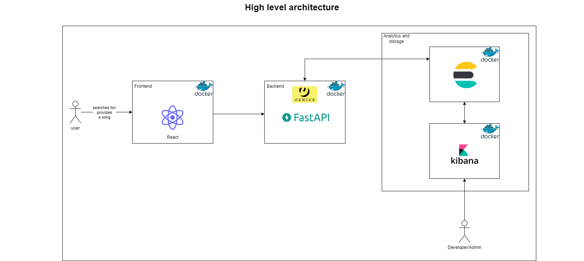
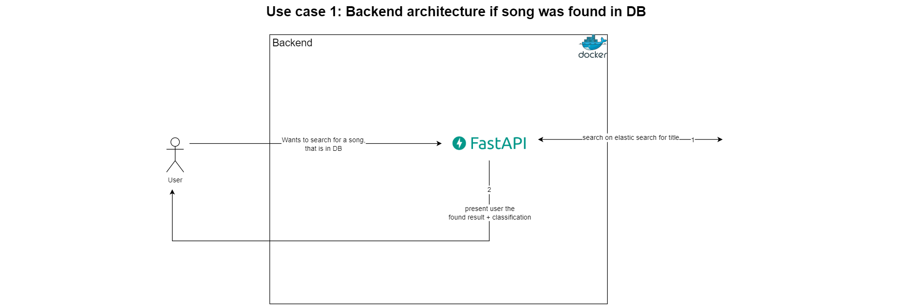
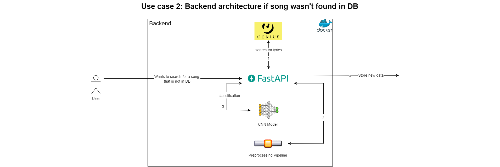
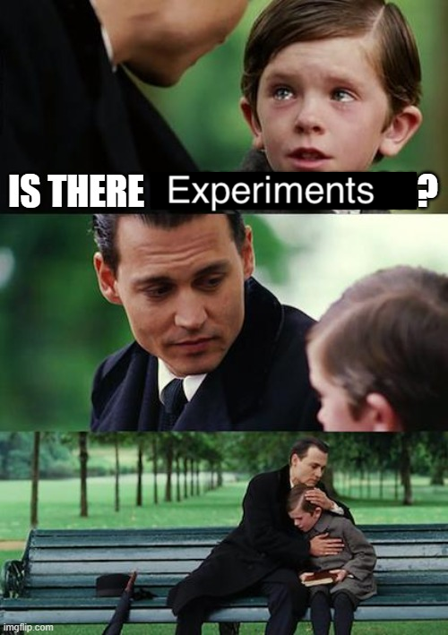

# Project: Data Science for Text Analytics
## Project details
#### Title: 
A Song Recommendation System using Lyrics Sentiment Classification

#### Team members: 
- Pascal Hansen (pascal.hansen@stud.uni-heidelberg.de)
- Simon Pavicic (simon.pavicic@stud.uni-heidelberg.de)
- Maximilian Ludwig (maximilian.ludwig02@stud.uni-heidelberg.de)

#### Existing code fragments
In this project we will use the Github project https://github.com/workmanjack/lyric-mood-classification as our starting point. We will utilize the developed CNN for mood classification based on lyrics in this project and apply it to our dataset (https://www.kaggle.com/datasets/neisse/scrapped-lyrics-from-6-genres?select=lyrics-data.csv).

#### Utilized libraries
The utilized libraries can be found in our requirements.txt file in the root of our Github project. In general, the code of our project can be started by simply using the command ``` docker-compose up ```, which installs, builds and starts all necessary services and libraries. Only docker (preferably in Linux or WSL2) is a prerequisite. Please note that it might take up to ~5 minutes to start the application properly, based on your system.

#### Contributions
See commit history. 


## Project state
#### Planning state
So far we have performed data analysis on lyrics and artist data from kaggle (see data analysis readme). Furthermore based on the labels found in the baseline paper for this project we have scraped the kaggle and last.fm dataset to see whether or not the lyrics are suitable for an ML driven sentiment classification approach. Based on the given datasets and planning state, we have two major options to choose from in order to recommend similar songs (sentiment) based on the input lyrics or song name given by the user. 

*Option 1:*
Most of the songs that are in the kaggle dataset are also found in the last.fm database (accessible via last.fm API). Therefore the kaggle songs can be labeled based on the user input found in the last.fm data. Using these labels we can train our own ML model using the labels as the gold labels for the model. New songs get classified by this model. Best matching songs for the same sentiment get ordered by cosine similarity in order to give the best recommendation for the same sentiment. 

*Option 2:* 
We are not able to label our songs from the kaggle dataset, since they are not included in the lastfm dataset.
However we can determine similar songs based on combinations of cosine similarity, pearson, clustering and non negative matrix factorization (NMF).
Furthermore it is possible to think of additionally labeling each songs sentiment based on new keywords we defined that were found often in the kaggle dataset.


#### Future planning 

As you can see in our data analysis, we found that ~ 93,4 % of the songs in the kaggle dataset are contained in the last.fm dataset. Furthermore, we can assign moods based on the labels found in the last.fm dataset for ~ 15,02 % of all songs. After first adjustments, the ratio can be even expanded to 24,58 % by modifying the keywords for the moods. 
This may not seem like much, however, since our overall database consists of 200.00 songs, this presents us a solid base of training data. Hence we will chose option 1 (see pervious section Planning state) to classify song sentiments and recommend similar songs based on the lyric or song name input. For the complete analysis on the distributions, please refer to our data analysis.

Following a short depiction of our aimed preprocessing steps for our ML model: 
- Tokenization
- Stop word removal (English language)
- Punctuation removal
- Lemmatization
- Lyrics normalization (length, etc.)
- Optional: Chorus normalization

Preprocessing for recommendation based on cosine similarity after sentiment classification:
- Count-Vectorizer 
- Optional: Term Frequency Inverse Document Frequency (TF-IDF)

Other preprocessing steps are possible if required.


#### High-level architecture description
In the following picture, you can see the high level architecture of the project in regard to the technology stack that will be used. 


<br>

As you can see, the project relies on a classic 3-tier architecture (Frontend, Backend, Database (Although our database is layer is more sophisticated than in a normal architecture)). Each tier is hosted on a docker container. 
The project harnesses React as frontend framework and FastAPI as backend. Furthermore, the backend relies on the Genius API to search for songs that might have not yet been included in the Elasticsearch database. 
As storage solution the project relies on Elasticsearch in combination with Kibana for a better UI. In Elasticsearch, the songs will be stored alongside their according moods, so that after an initial classification, the mood of a song can be retrieved very quickly. 

##### use case 1: The song can be found in the DB
The following image displays the use case in which a song was found in Elasticsearch (The song has been already analyzed).



As you can see, if the song can be found in Elasticsearch, the backend will simply return the song and the according classification so that the user can receive it. 


##### use case 2: The song cannot be found in the DB

The following image displays the use case in which a song was not found in Elasticsearch (The song hasn't been analyzed yet).


If a user queries for a song that is not in the database yet, the backend will access the Genius API and search for the song. If it can be found, it will scrape for the lyrics. After that, the lyrics need to be preprocessed in a preprocessing pipeline, which will be presented in more depth in the following section. After the preprocessing, the song can be analyzed then using the CNN of the baseline project. After that the result will be stored in Elasticsearch.

**Preprocessing pipeline:** See section future planning above. 


## Data analysis 
#### Data Sources, Preprocessing and Basic Statistics
For a detailed description of the data analysis performed please see *ta_lyrics_sentiment_classification/data_exploration/readme.md* as well as the jupyter notebooks found under *ta_lyrics_sentiment_classification/data_exploration/*.

#### Experiments 


## Start guide
Clone the repository and run from the root of it:
``` docker-compose up ```
This will start up the docker containers specified in the docker-compose file.
After that you should be able to see them with ``` docker ps ```. 
If you want to connect to them use ``` docker exec -it <container_name or ID> /bin/sh ```

You can then start or stop these services at anytime by typing
```
docker-compose start 
docker-compose stop
```

The startup may take a while. When the appearing log messages in the terminal are stalling, the app should be ready to use.
- Kibana is accessed by http://localhost:5601
- Elasticsearch is accessed by http://localhost:9200
- FastAPI is accessed by http://localhost:8000
- React is accessed by http://localhost:3000

### Start up only certain services
To start only certain services like FastAPI, Elasticsearch or Kibana, you can use the following command:
```
docker-compose start <servicename>
```
Please note that this might only work if you have run 
```
docker-compose up
```
previously and stopped the container services.

### Update the images
When you update the dockerfiles or let's say the npm dependencies (basically anything that needs to be build) you might want to run ``` docker-compose build ``` to create a new image version. Otherwise the container might not have the correct dependencies injected.


## Coding guidelines
#### Code formatting 
For code formatting we will use Black: https://github.com/psf/black. 

#### Docstring format
Function and class descriptions will follow the Sphinx guideline as shown here: https://sphinx-rtd-tutorial.readthedocs.io/en/latest/docstrings.html.


## Troubleshooting:
### The application takes so long to start
If you are using windows, try to clone the repository into your wsl file system and run it from there. Especially the frontend is running extremely slowly otherwise.
