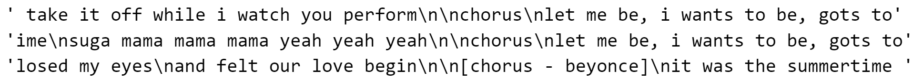
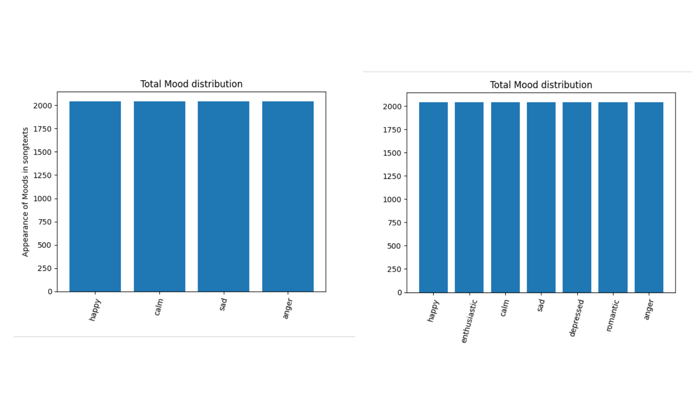
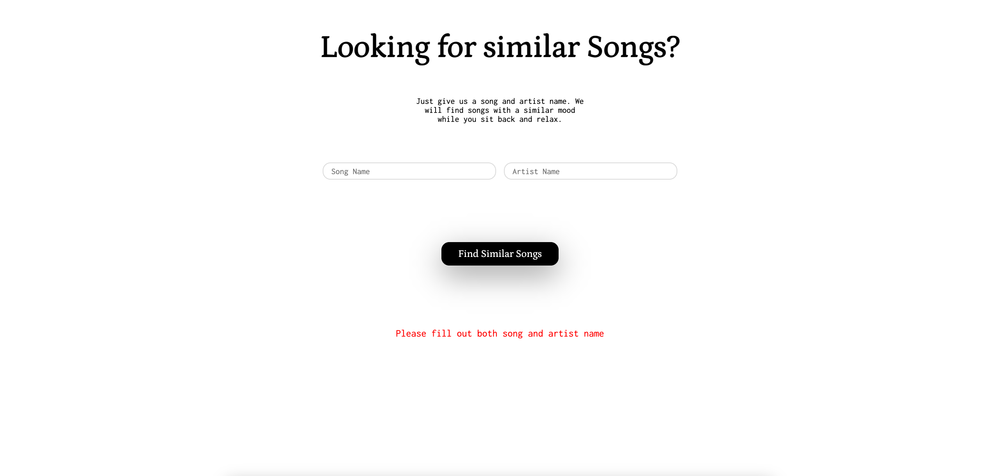

# Project: Data Science for Text Analytics
## Project details
#### Title: 
A Song Recommendation System using Lyrics Sentiment Classification

#### Team members: 
- Pascal Hansen (pascal.hansen@stud.uni-heidelberg.de)
- Simon Pavicic (simon.pavicic@stud.uni-heidelberg.de)
- Maximilian Ludwig (maximilian.ludwig02@stud.uni-heidelberg.de)

#### Existing code fragments and dataset
In this project we will use the Github project https://github.com/workmanjack/lyric-mood-classification as our starting point. We will utilize the developed CNN for mood classification based on lyrics in this project and apply it to our dataset (https://www.kaggle.com/datasets/neisse/scrapped-lyrics-from-6-genres?select=lyrics-data.csv). The data of the dataset needs to be downloaded from heibox (https://heibox.uni-heidelberg.de/d/e7f92e149b804a82be8b/) and the <em>data</em> folder containing the .csv files needs to be placed in the <em> ta_lyrics_sentiment_classification/data_exploration/ </em> folder.

#### Utilized libraries
The utilized libraries can be found in our requirements.txt file in the root of our Github project. In general, the code of our project can be started by simply using the command ``` docker-compose up ```, which installs, builds and starts all necessary services and libraries. Only docker (preferably in Linux or WSL2) is a prerequisite. Please note that it might take up to ~5 minutes to start the application properly, based on your system.

### wait-for-it.sh
The wait-for-it.sh script used for the elasticsearch component was taken from https://github.com/vishnubob/wait-for-it. 
It is used to check if the elasticsearch node is already started, and if so, execute further steps to create the neccessary indicies or fill es with dummy data.

#### Contributions
See commit history. 


## Project state

#### Data analysis 
##### Data Sources, Preprocessing and Basic Statistics
For a detailed description of the data analysis performed please see *ta_lyrics_sentiment_classification/data_exploration/readme.md* as well as the jupyter notebooks found under *ta_lyrics_sentiment_classification/data_exploration/*.
##### Experiments 


#### Planning state
So far we have performed data analysis on lyrics and artist data from kaggle (see data analysis readme). Furthermore based on the labels found in the baseline paper for this project we have scraped the kaggle and last.fm dataset to see whether or not the lyrics are suitable for an ML driven sentiment classification approach. Based on the given datasets and planning state, we have two major options to choose from in order to recommend similar songs (sentiment) based on the input lyrics or song name given by the user. 

*Option 1:*
Most of the songs that are in the kaggle dataset are also found in the last.fm database (accessible via last.fm API). Therefore the kaggle songs can be labeled based on the user input found in the last.fm data. Using these labels we can train our own ML model using the labels as the gold labels for the model. New songs get classified by this model. Best matching songs for the same sentiment get ordered by cosine similarity in order to give the best recommendation for the same sentiment. 

*Option 2:* 
We are not able to label our songs from the kaggle dataset, since they are not included in the last.fm dataset.
However we can determine similar songs based on combinations of cosine similarity, pearson, clustering and non negative matrix factorization (NMF).
Furthermore it is possible to think of additionally labeling each songs sentiment based on new keywords we defined that were found often in the kaggle dataset.


#### Future planning 
As you can see in our data analysis, we found that ~ 93,4 % of the songs in the kaggle dataset are contained in the last.fm dataset. Furthermore, we can assign moods based on the labels found in the last.fm dataset for ~ 15,02 % of all songs. After first adjustments, the ratio can be even expanded to 24,58 % by modifying the keywords for the moods. 
This may not seem like much, however, since our overall database consists of 200.00 songs, this presents us a solid base of training data. Hence we will chose option 1 (see previous section Planning state) to classify song sentiments and recommend similar songs based on the lyric or song name input. For the complete analysis on the distributions, please refer to our data analysis.

Following a short depiction of our aimed preprocessing steps for our ML model: 
- Tokenization
- Stop word removal (English language)
- Punctuation removal
- Lemmatization
- Lyrics normalization (length, etc.)
- Optional: Chorus normalization

Preprocessing for recommendation based on cosine similarity after sentiment classification:
- Count-Vectorizer 
- Optional: Term Frequency Inverse Document Frequency (TF-IDF)

Other preprocessing steps are possible if required.


#### Final implementation
<TODO: 
--> Cnn infos max 

As most of the songs of the used Kaggle dataset can be found in last.fm and therefore in total around 29k songs could be assigned to a sentiment, we decided for option 1.


##### Data Cleaning 
Before we actually used this data, we needed to apply certain steps for filtering and cleansing the data from abnormalities (e.g., lyrics that only contain the word "instrumental"), as seen in the data exploration chapter.
Hence, we started to remove non-english songs and took only songs that have more than 70 but less than 1000 words.
Furthermore, we were removing certain character sequences from the lyrics, such as anything related to the word chorus indicating that there the chorus defined at the beginning of the song is sung.
Besides specific words like chorus that are not part of the actual lyrics, some lyrics also contain information about the artist that is singing a specific part of the song. 
These kind of information has been mostly placed in special parentheses like [], <>, (), {}. 
To remove this, we were using regular expressions and filtered all text sequences inside parentheses (including the parentheses). 

The data cleaning and filtering of the kaggle dataset has been performed in the Jupyter notebook "kaggle_data_preprocessing.ipynb", which saves all the cleaned data in a .csv file. 


##### Data Storage
To store the data, we are using Elasticsearch. 
We created our own Elasticsearch index "lyrics_mood_classification" that saves information on the song name, artist name, lyrics and mood/sentiment for each song from the Kaggle dataset.
To initialize the Elasticsearch index, we are firstly using the .csv file created in the "kaggle_data_preprocessing.ipynb".
During this first index creation process, we are saving the index in an Elasticsearch dump file containing all information from the Elasticsearch index.
For later initializations of the index, e.g., when the Docker container has been removed, the Elasticsearch dump file will be used, providing a faster start up.


##### Data Preprocessing 
After cleaning the data we need to further prepare the data for the CNN model. 
The folowing steps were performed using the spacy (https://spacy.io/) python library. Spacy allows us to easily perform the folloing steps using predefined english tokenizers, stop words, punctutation and lemmatization. 
- Tokenization
- Stop word removal (English language)
- Punctuation removal
- Lemmatization

The previous preprocessing steps are all performed on the lyrics of a new song that needs to be classified by the CNN model. 

After receiving a mood for a given song, similar songs are searched for using the Term Frequency Inverse Document Frequency (TF-IDF) method. All songs that contain the same mood are processed. After converting all songs with the same mood cosine similarity is used to find the top 3 matching song lyrics. 


##### Balancing and normalizing the sentiments
As described above we had a vast amount of songs that could be classified. However, the moods we could derive from our gold labels from last.fm were quite unbalanced as depicted below:


Hence we decided to reduce the number of different moods and combine the sentiments where possible. Two approaches were thereby considered: The first one aligns with an approach of our baseline project which faced a similar issue. To solve this they split the moods only in 4 categories: happy, sad, calm and anger by combining some of the other moods with them and disregarding the once that didn't seem to fit in. We did the same but used more moods than the original paper, by only omitting the moods "desire, romantic, confident, dreamy" instead of "dreamy, desire, earnest, pessimism, romantic, brooding". The moods were reassigned based on the following schema: 

happy = cheerful, happy, excitement, upbeat
sad = grief, sad, pessimism, angst, depressed
calm = calm, brooding, earnest
anger = anger, aggression

The resulting distribution is as follows: 


The second approach was to combine less moods so that we had more sentiments to classify to. We've done this because otherwise it might not be as useful for a user to simply know if his song is happy or sad. So we thought by using more sentiments we could achieve a better user experience. For this approach we combined the following moods:

enthusiastic = excitement, upbeat, cheerful
happy = happy
sad = grief, sad 
depressed = pessimism, angst, depressed
romantic = romantic, desire
calm = calm, brooding, earnest
anger = anger, aggression

As a result we only omitted dreamy as a mood, which was not present in our dataset in the first place.
The distribution for this approach is depicted below:


Both approaches were unbalanced, meaning that some moods were over represented and other underrepresented. Hence, we normalized the amount of songs for each sentiment to the amount of songs available for the sentiment with the least songs, resulting in the following distribution:



This reduced the amount of songs we could train on, but it also ensured that we wouldn't overfit to a specific mood. As a comparison we trained our model on the two normalized approaches, as well as on the unbalanced and un normalized dataset.


#### CNN creation 
As mentioned above the CNN was trained on the three different datasets  (unbalanced dataset, four mood dataset and seven mood dataset). Since it was out of scope to create a CNN completely on our own and trying to optimize it, we took an approach from [kaggle](https://www.kaggle.com/code/jagannathrk/word2vec-cnn-text-classification) to speed things up. This gave us some formal processing steps as well as a sample CNN which we then trained on our test sets also with some hyperparameter optimization. Before putting the training data into the model, we preprocessed the song lyrics in order to achieve better results. The preprocessing pipeline is described in the above section "Data Preprocessing".
The following table depicts the results of the best performing hyperparameter combination for each dataset (The optimization can be seen in the notebook data_exploration/CNN-Model-Creation.ipynb):

| Dataset             | Model Accuracy (%) | Random Prediction (%) | Improvement to Random (Accuracy/Random Prediction) |
|---------------------|-------------------|-----------------------|-----------------------------------------------------|
| unbalanced dataset  | 30.96             | 5.88                  | 5.265                                               |
| 4 moods balanced    | 34.72             | 25                    | 1.388                                               |
| 7 moods balanced    | 23.58             | 14.29                 | 1.65                                                |


As one can see, the balanced four moods approach did perform best, followed by the unbalanced one and at last the balanced one with seven moods. This is to be expected, since the chance of a random prediction being correct for four moods is quite high as opposed to the other approaches. Taken into account the random chance, the unbalanced approach did perform best which is also expected since it has most likely overfitted to the mood "sad" which was represented way more often than any other mood. The at first glance weakest approach of the seven moods hence works best when taking the random chance into account and the fact that the first model is not viable.


<TODO: Text on preprocessing pipeline, i.e., tokenization, stopword removal, ... (Simon/Max)>

When one enters a song that is not in the Elasticsearch index yet, we are applying the CNN and then adding the song to our Elasticsearch index with the classified mood.

<TODO: Text on tfidf+cosine simularity computation, frontend (Simon)>


#### High-level architecture description
In the following picture, you can see the high level architecture of the project in regard to the technology stack that will be used. 


<br>

As you can see, the project relies on a classic 3-tier architecture (Frontend, Backend, Database (Although our database is layer is more sophisticated than in a normal architecture)). Each tier is hosted on a docker container. 
The project harnesses React as frontend framework and FastAPI as backend. Furthermore, the backend relies on the Genius API to search for songs that might have not yet been included in the Elasticsearch database. 
As storage solution the project relies on Elasticsearch in combination with Kibana for a better UI. In Elasticsearch, the songs will be stored alongside their according moods, so that after an initial classification, the mood of a song can be retrieved very quickly. 

##### use case 1: The song can be found in the DB
The following image displays the use case in which a song was found in Elasticsearch (The song has been already analyzed).


As you can see, if the song can be found in Elasticsearch, the backend will simply return the song and the according classification so that the user can receive it. 


##### use case 2: The song cannot be found in the DB

The following image displays the use case in which a song was not found in Elasticsearch (The song hasn't been analyzed yet).


If a user queries for a song that is not in the database yet, the backend will access the Genius API and search for the song. If it can be found, it will scrape for the lyrics. After that, the lyrics need to be preprocessed in a preprocessing pipeline, which will be presented in more depth in the following section. After the preprocessing, the song can be analyzed then using the CNN of the baseline project. After that the result will be stored in Elasticsearch.


##### Frontend Implementation 
The frontend allows the user to pass a song as well as an artist name to the fields "Song Name" and "Aritst Name" respectively. 
When clicking the button "Find Similar Songs" the mood of the song is classified and similar songs are searched for.
After that, the top 3 most similar songs are presented.  
Example: 


If the input is not correct (e.g. missing artist name) a error message will be presented. 
Example:




## Start guide
The following steps need to be executed in order to get the project up and running:
1. clone the repository
2. navigate in a wsl shell to the root of it
3. execute ``` docker-compose up ```
   1. Wait for the building steps to finish (This might take several minutes until all packages are installed)
      1. If there appears to be an error during build time of the images, simply run again the command ``` docker-compose up ```
   2. When the container are setting up wait for ~1 minute for every service to be available (elasticsearch might take a short time)
4. Navigate in your browser to http://localhost:3000
   1. The application is neither designed nor adapted to specific browsers. We tested succesfully with google chrome and recommend it for the testing. Usage of other browsers might lead to misbehaviour or unpredicted behaviour
5. Use the application
   
## Debugging
If you want to connect to a specific container after you ahve run the above mentioned docker command, execute the follwoing command in a new terminal:
``` docker exec -it <container_name or ID> /bin/sh ```

The startup may take a while. When the appearing log messages in the terminal are stalling, the app should be ready to use.
- Kibana is accessed by http://localhost:5601
- Elasticsearch is accessed by http://localhost:9200
- FastAPI is accessed by http://localhost:8000
- React is accessed by http://localhost:3000

### Start up only certain services
To start only certain services like FastAPI, Elasticsearch or Kibana, you can use the following command:
```
docker-compose start <servicename>
```
Please note that this might only work if you have run 
```
docker-compose up
```
previously and stopped the container services.

### Update the images
When you update the dockerfiles or let's say the npm dependencies (basically anything that needs to be build) you might want to run ``` docker-compose build ``` to create a new image version. Otherwise the container might not have the correct dependencies injected.


## Coding guidelines
#### Code formatting 
For code formatting we will use PEP8: https://peps.python.org/pep-0008/. 

#### Docstring format
Function and class descriptions will follow the Sphinx guideline as shown here: https://sphinx-rtd-tutorial.readthedocs.io/en/latest/docstrings.html.


## Troubleshooting:
### The application takes so long to start
If you are using windows, try to clone the repository into your wsl file system and run it from there. Especially the frontend is running extremely slowly otherwise.
