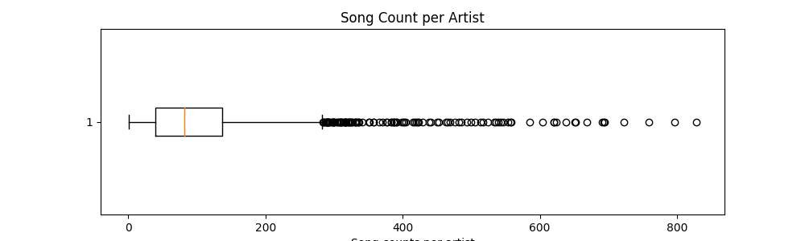
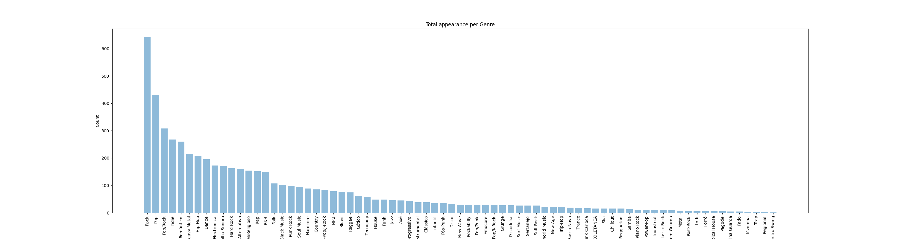
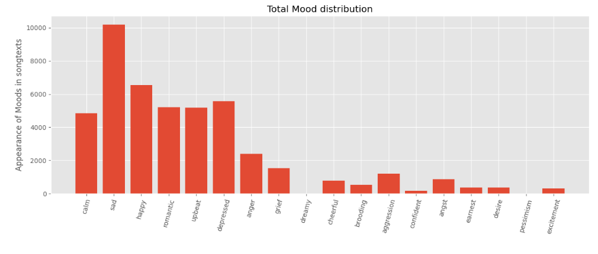

# Data Exploration
For our project we chose to use the lyrics and artist dataset from kaggle (https://www.kaggle.com/datasets/neisse/scrapped-lyrics-from-6-genres?select=lyrics-data.csv) containing songs from 79 musical genres.
Let's take a closer look at the provided datasets.

## Lyrics Dataset Overview
The lyrics dataset contains lyrics of a number of songs as well as some metadata.
First of all, let's look at the contained languages:  

 

As you can seen in the distribution, most songs in the dataset are either written in English or Portuguese. Overall, 53 languages exist in the dataset itself. However as stated before, only Portuguese and English make up the most relevant part of the data. We will limit the project to English songs, as this simplifies the mood classification significantly.

After filtering the lyrics dataset to English, we need to look at the general information of the data, such as number of rows, contained columns, non-null count, data types, etc.: 
There are 191814 rows and 5 columns in the filtered dataframe.
The following image shows the contained columns and there Non-Null value counts. 

Let's take a look at the first 10 lines in order to get an understanding of what is contained in the data set. 

As we can see,
- **ALink** contains a link representation to the corresponding artist
- **SName** contains the name of the song
- **SLink** contains the link representation of the song name 
- **Lyric** contains the lyrics of each song
- **language** contains the language of the lyrics

## Artist Dataset Overview
The artist dataset contains a list of artists and some metadata. 
The unfiltered dataset contains 4168 rows and 5 columns. 

The following image shows the contained columns and there Non-Null value counts. 

Let's take a look at the first 10 lines in order to get an understanding of what is contained in the data set. 

As we can see,
- **Artist** contains the name of the artist
- **Genres** contains genres of the artist's songs
- **Songs** contains number of songs of the artist
- **Popularity** contains rating/popularity of the artist
- **Link** contains a link representation to the corresponding artist (same as ALink from lyrics data)

## Analysis 
After merging lyrics and artist data on the ALink and Link, let's take a closer look at what is contained in the data in order to get a better understanding of what we are working with. 

### Song counts per artist
The following figure shows the distribution of song counts per artist. 

As we can see, 50% of artists have between around 50 and 150 songs associated with them, with a median = 82 and mean = 104.994.

### Genres
Let's take a look at the genres in the dataset and their distribution. 
The following figures show the total appearance (count) of songs per genre for all genres as well as the top 20 genres. 

### Popularity
The popularity is also provided in the datasets. Let's see, if the count of songs per genre correlates with the popularity of the genres. 

As we can see, the popularity does not correlate with the amount of songs per genre, since piano rock and soft rock seem to be the most popular. 
This popularity per genre is another aspect to keep in mind for the preprocessing. 

Also let's look at the popularity per artist, to get a feeling of the most popular artists in the dataset. As we can see, beyonce, sia, anitta, adele, eminem and ed-sheeran are by far the most popular artists. 

### Average word count per song
Another interesting metric is to look at is the length of the songs, as depicted in the following graphics:

As you can see, there is big span in the word count of the songs in the dataset. The minimum value is 1, whereas the maximum value is 3422. 
However, as you can also see, 50% of the songs have a word count of roughly 200 - 300 words per song, with a variance of approximately 250.
The average of the amount of words in a song is about 250, the median is at 211.

Since the minimum value word count is 1, we looked closer into the specific lyrics with just one word and found out that this is not due to the Tequila song but rather due to instrumental songs, which are just represented as "Instrumental", "instrumental", ... as their lyrics. In total 5027 songs are instrumental, which is about 1.323 % of all songs, as you can see in the following figure:

In the preprocessing step, we will filter the instrumental songs out.

### Song redundancy
We discovered two forms of song redundancy. First of all, songs that are from a collaboration of different artist appear mostly twice in the dataset, e.g., the song "The Monster" from Eminem features by Rihanna. 

Here, we will remove the song that does not contain labels in the last.fm dataset. If both contain labels, then we will remove the song from the featuring artist, since we do not want to train twice on the same song.

Furthermore, some lyrics are not entered correctly and contain rather metadata instead of the actual lyrics. This leads to lyrics redundancy. This is specifically the case for certain artists, e.g. Donovan Leitch, which has the same metadata lyrics for 19 songs:

Here, we would need to filter the incorrect as well as the redundant lyrics in the preprocessing step.

### Comparing lyrics
Lyrics can differ in their text representation. This is easy to see when we compare the same lyrics just stored under different artist, e.g., for the song "The Monster" by Eminem Feat. Rihanna: First the lyrics under Eminem:

And this compared to the lyrics stored under Rihanna:

When applying the SequenceMatcher.ratio() to evaluate both lyrics quantitatively, the obtained ratio is 16.567 %. This shows that there are have quite some differences in the lyrics regarding their text representation. When looking closer, it gets obvious why the text ratio differs so greatly. Eminem's lyrics of "The Monster" is 3453 characters long, whereas Rihanna's lyrics is only 2728 characters long. To find out why the text have this difference in length we look into both lyrics and see that in Rihanna's song lyrics some parts are marked with "[Hook]". This means that the hook got defined once in the beginning and then is just represented in the text by "[Hook]" when the hook was repeated. Therefore, we need to face this during text preprocessing, e.g., by replacing "[Hook]" with the actual text for all occurrences, as well as for other definitions like [Verse 1] that we encounter in the song lyrics.

### Analyzing the lastfm labels 
The approach to get gold labels for the mood of our songs was introduced in our baseline project (https://github.com/workmanjack/lyric-mood-classification). They harnessed the last.fm dataset, searched for the user created tags for each song, and assigned a mood to the song if the song contains at least one keyword mapped to a specific mood. They used overall 18 different moods. The following graphic depicts the moods and their keywords:

(Due to technical issues we can only perform the analysis on two thirds of the dataset until the milestone is due. We will submit the analysis for the whole dataset in the near future).
Overall ~93,4 % of our 191.387 scraped songs could be found on lastfm. 
Furthermore ~78,0 % of the songs, which were analyzed have labels.
However, since not every label is useful to us, we need to filter further on the "useful" labels, which are the keywords already describe above. 

As you can see ~15,02 % of the songs have a useful label. This ratio can be increased further by modifying the keywords. The below depiction for instance accepted all labels that contain the keyword. For example the label "a very happy song, which i like" is in this approach counted towards the keyword "happy", which hasn't been done in the beforehand approach. This enabled us to reach a rate of 24,58 % of all songs being labeled "usefully".

However, as you can also see, this approach reshapes also the distribution of moods in the dataset, which needs to be kept in mind for the training of our ML model.
Baseline approach:

Advanced approach:

Still we need to take a closer look on how we can prevent words like "unhappy" being counted in the mood "happy" (as well as for the other moods). This will be done in the following weeks.

### Weird Artist Names
One last thing to consider for preprocessing are some of the artist names. 
As seen in the following figure, artist names also include movie titles. This needs to be filtered in some way during the preprocessing. 

