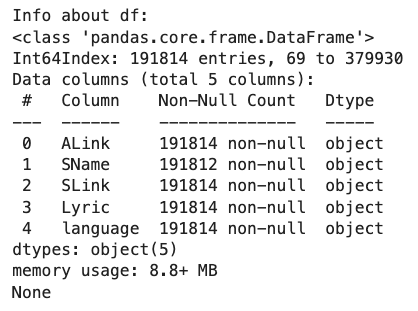
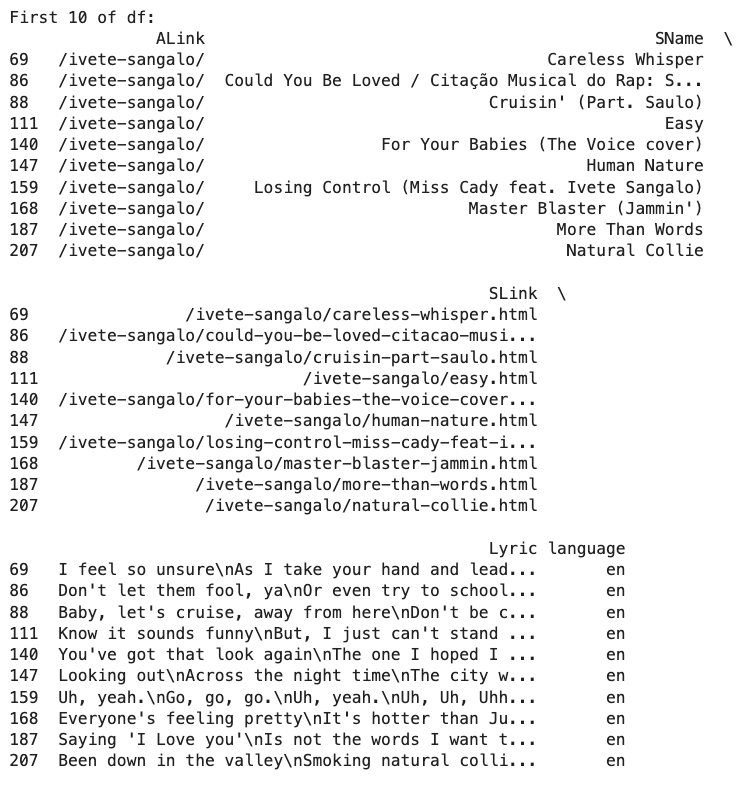
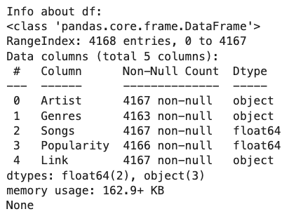
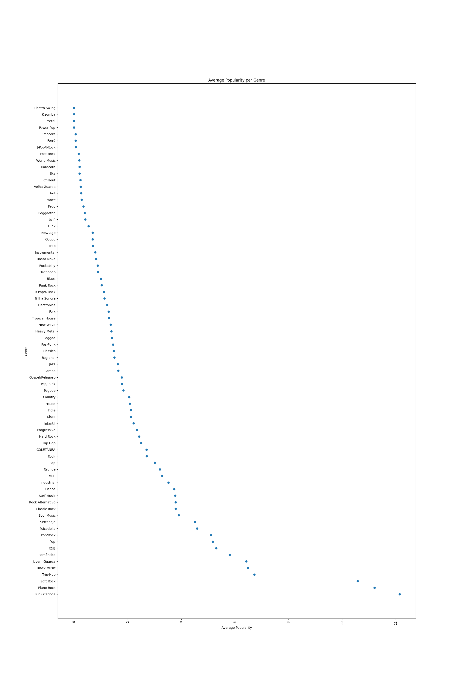
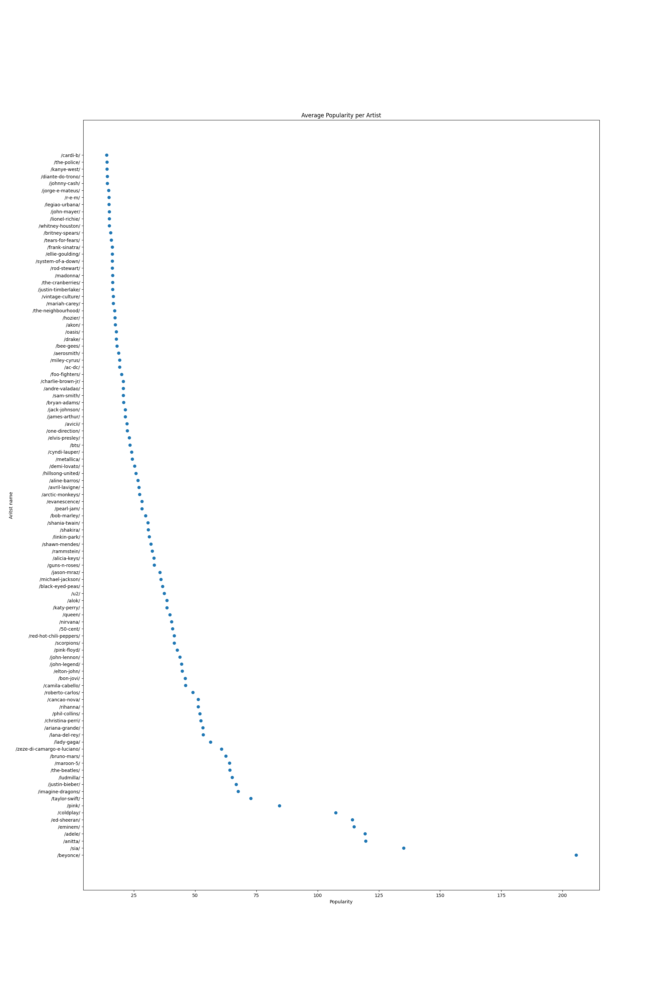

# Data Exploration
For our project we chose to use the lyrics and artist dataset from kaggle (https://www.kaggle.com/datasets/neisse/scrapped-lyrics-from-6-genres?select=lyrics-data.csv) containing songs from 79 musical genres.
Let's take a closer look at the data sets provided.

## Lyrics Dataset
The lyrics dataset contains lyrics of a number of songs, as well as some metadata.
First of all let's look at the contained languages:  

DISTRIBUTION OF LANGUAGES   

As seen in the distribution, most songs in the dataset are either written in english or portugese. We will limit our project to english songs. 

After filtering the lyrics dataset to english we need to look at the general information about the data, such as number of rows, contained columns, non-null count, datatypes, etc.: 
There are 191814 rows and 5 columns in the filtered df.
The following image shows the contained columns and there Non-Null value counts. 

Let's take a look at the first 10 lines in order to get an understanding of what is contained in the data set. 

As we can see,
- **ALink** contains a link representation to the corresponding artist
- **SName** contains the name of the song
- **SLink** contians the link representation of the song name 
- **Lyric** contains the lyrics of each song
- **language** contains the language of the lyrics

## Artist Dataset
The artist dataset contains a list of artists and some metadata. 
The unfiltered dataset contains 4168 rows and 5 columns. 

The following image shows the contained columns and there Non-Null value counts. 

Let's take a look at the first 10 lines in order to get an understanding of what is contained in the data set. 

As we can see,
- **Artist** contains the name of the artist
- **Genres** contains gneres of the artist's songs
- **Songs** contians number of songs of the artist
- **Popularity** contains rating/popularity of the artist
- **Link** contains a link representation to the corresponding artist (same as ALink from lyrics data)

## Analysis 
After merging lyrics and artist data on the ALink and Link, let's take a closer look at what is contained in the data in order to get a better understanding of what we are working with. 

### Song counts per artist
The following figure shows the distribution of song coutns per artist. 

As we can see, 50% of artists have between 0 and 200 songs associated with them, with a median = 82 and mean = 104.994.

### Genres
Let's take a look at the genres in the dataset and their distribution. 
The following figures show the total appearance (count) of songs per genre for all genres as well as the top 20 genres. 

As we can see, some genres are displayed twice, such as Pop. this is something we need to keep in mind for the data preprocessing steps in order to clean the data appropriatly. 

### Popularity
The popularity is also provided in the datasets. Let's see, if the count of songs per genre correlates with the popularity of the genres. 

As we can see, the popularity does not correlate with the amount of songs per genre, since piano rock and soft rock seam to be the most popular. 
This popularity per genre is another aspect to keep in mind for the preprocessing. 

Also let's look at the popularity per artist, to get a feeling of the most popular artists in the dataset. As we can see, beyonce, sia, anitta, adele, eminem and ed-sheeran are by far the most popular artists. 

### Weird Artist Names
One last thing to consider for preprocessing are some of the artist names. 
As seen in the following figure, artist names also include movie titles. This needs to be filtered in some way during the preprocessing. 

